# Design Discussion

This document captures the **finalised** design direction for the three-theme system (F-023, D-035). All questions have been answered. This is the source material from which `style-guide/` and `page-guides/` were created.

All inspiration images are in `Documentation/design-inspiration/`.

---

## Part 1: Theme Inspiration

The app offers three UI themes — same features, different visual identity.

### Minimal

Clean, data-forward, productivity-tool aesthetic. Light backgrounds, bold typography, flat cards, grid layouts.

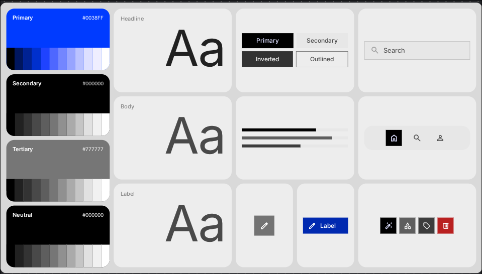 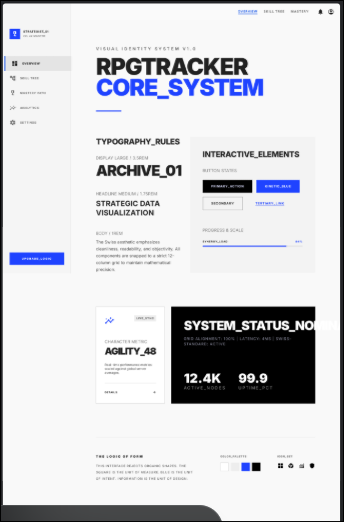 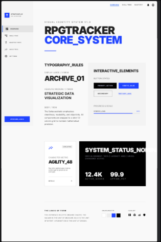 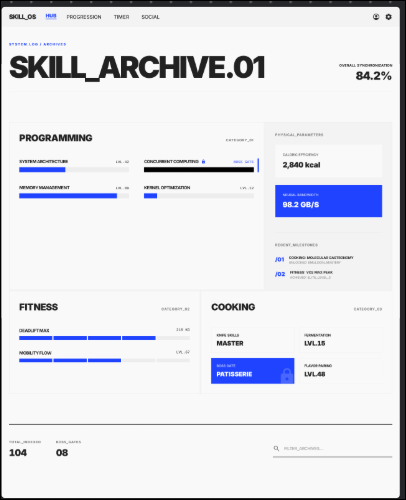    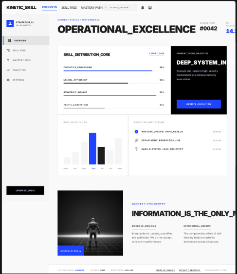

### Retro

Full RPG immersion. Dark backgrounds, amber/gold + purple, pixel art, character portraits, scanline textures, narrative framing.

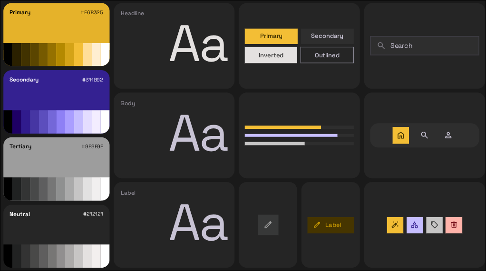 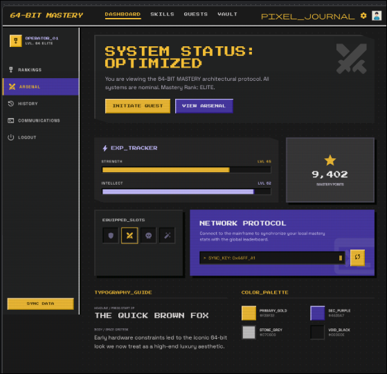 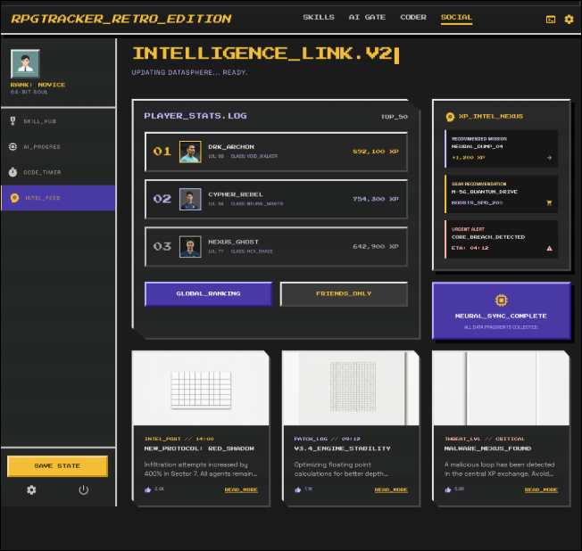 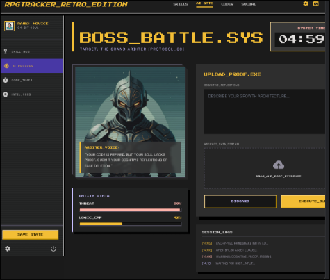 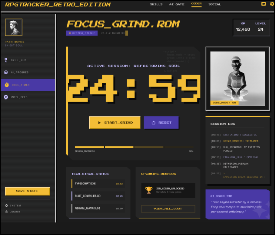 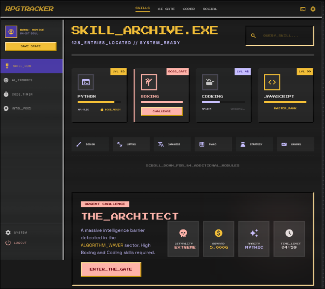 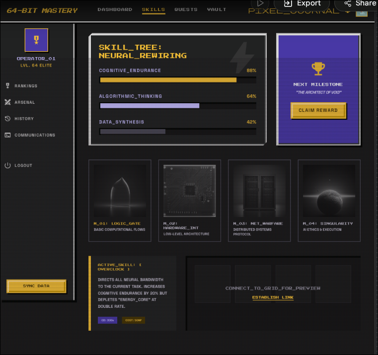 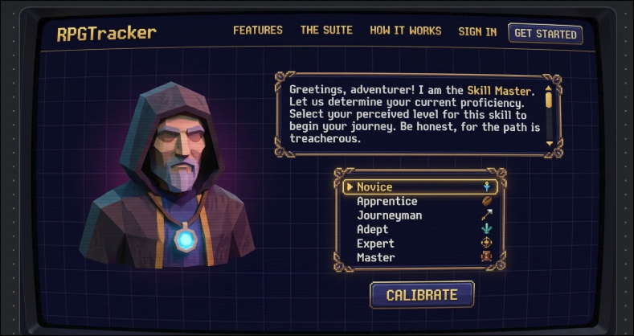 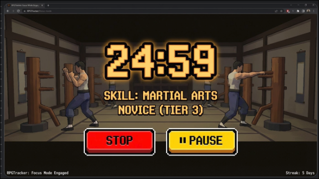

### Modern

Sci-fi command centre aesthetic. Dark navy, cyan + magenta, glass morphism, neon accents, atmospheric glows.

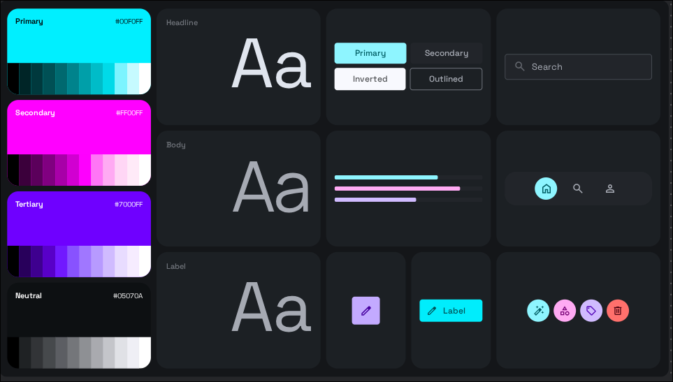 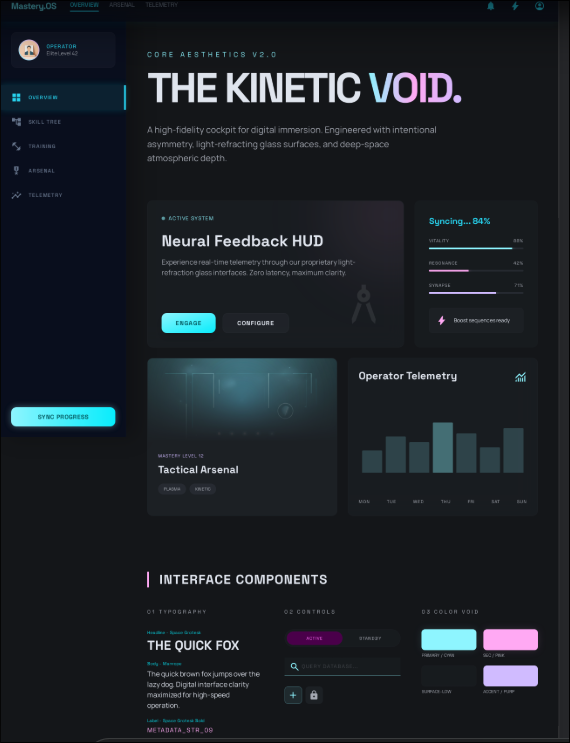 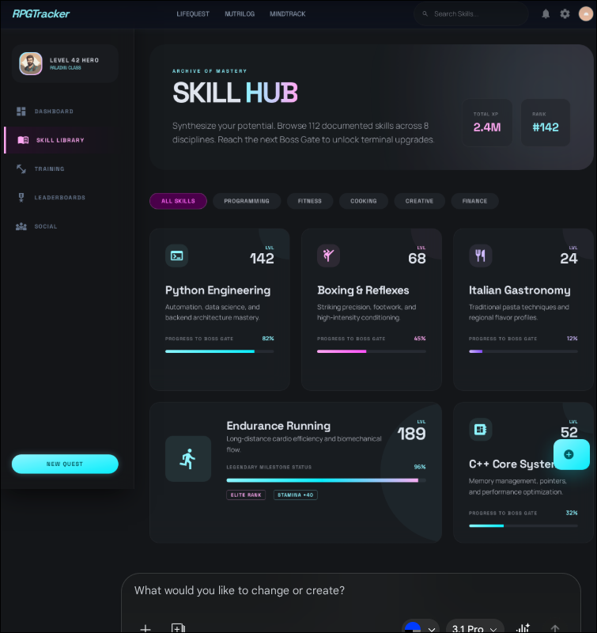 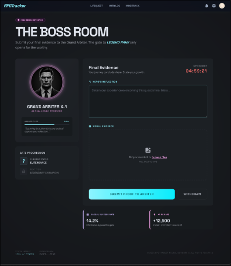 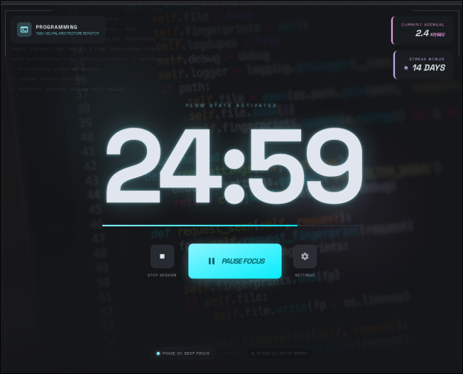 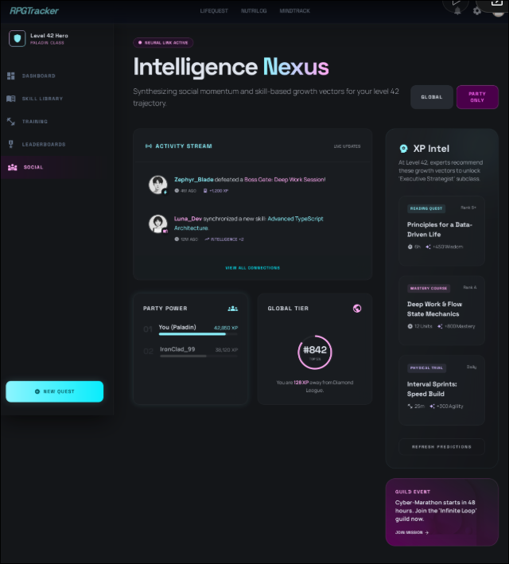 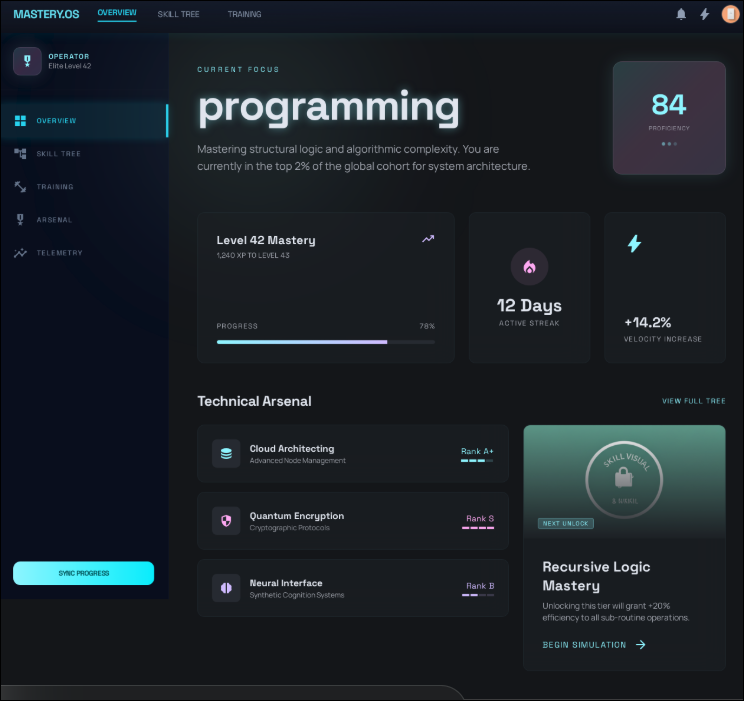

---

## Part 2: Page Design Briefs

### Landing Page

**Mood:** "A Call to Adventure" — cinematic, high quality bar, smooth transitions and animations that convey the mission statement. Mood alters slightly per theme but the core message is the same.

**Section Flow:** Hero (with theme switcher alongside) → Key Features → Suite Apps → Social Proof → CTA

**Decisions:**
- Default theme for first-time visitors: **Minimal** (safest/broadest appeal).
- Theme switcher on the hero lets visitors try all three before signing up.
- One landing page that adapts per theme — not three separate pages.
- Social proof section initially shows **mission statement expansion** and **beta feature highlights** as temporary content.
- Feature section animations are **theme-specific** (e.g., pixel-art reveals for Retro, holographic fades for Modern).

---

### Dashboard (`/dashboard`)

**Mood:** The user's home base. Sets the tone for the session they're about to start or recently completed.

**Hierarchy:**
1. **Primary Skill Focus / "Next Quest"** — centre stage. User can pin their "Main Quest"; system algorithmically suggests the most relevant based on goals, streaks, and recency. Both modes coexist.
2. **Stats** — 4 stat cards (Total Skills, Active Gates, XP Today, Highest Tier) at a glance.
3. **Activity Feed** — glanceable sidebar, not a primary section.
4. **Quick Log** — integrated collapsible panel between stats and skill grid. Easy, non-disruptive access.

**Hub Stats:** Placeholder cards for NutriLog/MindTrack show "coming soon" teasers with simple metric previews.

**Empty State:** Welcoming "Tutorial Quest" or "Choose Your First Skill" invitation, styled per theme. Invitation to begin, not an empty screen.

**Theme Variations:**
- **Minimal:** Clean overview. Data-forward stat cards, compact skill list, whitespace.
- **Retro:** Quest log / save-state feel. "Main quest" framing, narrative language, chunky stat blocks.
- **Modern:** Command centre / HUD. Stats as readouts, primary skill as mission briefing, holographic feed.

---

### Skills List (`/skills`)

**Mood:** The inventory of potential — the world is the user's oyster.

**Layout:** Flexible grid of cards. Each card: Name, Level, XP bar, Streak, Last Active. The "+ Log" button opens an **inline mini-form** (not navigation to skill detail).

**Controls:** Prominent toolbar for filtering and sorting. Scales to 100+ skills.

**Categories:** Hybrid system — preset categories (Physical, Mental, Creative, Professional, etc.) with user-defined tags for custom skills. Categories become the main organisational pillar at 50+ skills.

**"Favourites" filter** always accessible as a quick toggle.

**Empty State:** Same as dashboard — "let's get you into your first skill."

**Theme Variations:**
- **Minimal:** List-heavy, high density, compact rows, maximum info per viewport.
- **Retro:** Icons-first, chunky tactile buttons, pixel-art card borders.
- **Modern:** Animated cards, glowing status indicators, hover reveals, scroll motion.

---

### Skill Detail (`/skills/[id]`)

**Mood:** "The Deep Dive" — where the grind happens. This page is the engine room.

**Hierarchy:**
1. **Progress bar dominates** — the "hero" of the page. XP bar is the most important element. High-stakes action buttons (Start Session, Log XP) integrated alongside it.
2. **XP Chart** — prominent 30-day visualisation with **rolling average trend line**. Framing: "look how often you've shown up" — celebrate consistency, don't shame gaps. Empty days fade; active days glow.
3. **Gate Section** — challenging and significant when present. A milestone, not a speedbump.
4. **Activity History** — the grind record.

**Hero section** includes category/tags for context.

**Gate Mood:**
- **Minimal:** Motivating — clean challenge card, clear requirements, progress toward unlocking.
- **Retro:** Ominous — dark borders, dramatic language ("A barrier blocks your path..."), boss-fight energy.
- **Modern:** High-tech lockdown — security-scan aesthetic, "clearance required" language.

**Sessions:** "Start Session" navigates to `/skills/[id]/session` (skill-owned route). Full-screen immersion. Post-session summary displays as an overlay on the session route, then returns to skill detail on confirmation. Context-aware: Quick Sessions launched from Dashboard return to Dashboard instead.

**Activity History:**
- **Minimal:** Simple chronological list, clean date headers.
- **Retro:** Visual log — pixel icons, narrative entries ("You trained for 45 minutes").
- **Modern:** Timeline — vertical line with nodes, timestamps, subtle animations.

---

### Skill Create (`/skills/new`)

**Mood:** Character creation — engaging with a strong narrative. The user is defining a new dimension of their growth.

**Two paths:** Clearly separated **Preset path** (gallery/discovery experience showing expected gates and progression paths as preview) and **Custom Skill path** (full user control).

**Step Indicator:** Narrative-driven:
- Step 1: **"Identity"** — name and description (user-facing, shown on cards, kept prominent).
- Step 2: **"Appraisal"** — assess starting level via preset or manual selection.
- Step 3: **"The Arbiter"** — AI calibration. High-value selling point, presented as a dialogue. Visual avatar that changes per theme (sage for Retro, AI assistant for Modern, clean dialog for Minimal). This is a core feature, not a hidden power-user tool.

---

### Skill Edit (`/skills/[id]/edit`)

**Implementation:** Modal on the skill detail page (not a dedicated route). Follows general theme guidelines. Only available for custom skills — preset-based skills are not editable.

---

### Account (`/account`)

**Mood:** Utilitarian with character.

**Theme Picker:** High-visibility visual previews of each theme (screenshots or live mini-previews). The moment users discover they can transform their experience.

**Profile:** "Player Card" / "Operator Card" feel. Display name, avatar, and account stats:
- Total XP
- Longest streak
- Skill distribution across categories

**Avatar system:** Included — crucial to the app's feel. Theme-dependent default silhouettes; user upload planned as a feature.

**Sub-pages** (password, API key): Not pure utility — lightly themed, but less affected by theme variance than main pages.

---

### Auth Pages (`/login`, `/register`)

**Mood:** The beginning of the journey. Visual continuity from landing page — smooth transitions, not a context switch.

**Trust-first:** No immediate subscription upsell. 14-day free period. Subscription info visible but not aggressive. Registration page includes a brief feature preview / "what you'll get" alongside the form.

**Social auth:** Google, GitHub, Apple planned for launch.

**Copy tone:**
- **Retro/Modern:** Overt RPG language — "Begin your Quest."
- **Minimal:** Professional tone — welcoming but not themed.

---

### NutriLog Placeholder (`/nutri`)

**Vision:** Visual teaser, not a dead end. Generates anticipation. No email signup or waitlist — on release, everyone gets access for a period regardless of subscription.

NutriLog will be a **separate app** sharing data via shared database or message queues.

---

### Session Page (`/skills/[id]/session`)

**Mood:** Complete visual transformation — flow state. No nav, no distractions. Just timer, skill name, session controls.

**Theme Transformations:**
- **Minimal:** Clean countdown. Large timer, muted background, breathing animation. Meditation-app calm.
- **Retro:** Battle screen. Pixel-art timer, grinding effects, XP ticking up, chiptune-ready layout.
- **Modern:** Mission in progress. Holographic timer, pulsing glow, progress ring, "operation active" HUD.

**Session Flow:** Enter → Timer → Pause/Resume → Complete → Post-session summary overlay (XP earned, streak) → Context-aware return (skill detail or Dashboard).

**Features:**
- **Pomodoro:** Full support for work/break intervals.
- **Audio:** Optional ambient soundtracks (theme-appropriate).
- **Background:** Browser notifications when session completes (user can leave tab).
- **Quick Session:** Dashboard button for pinned/algorithmic quest — skips skill detail entry.

---

## Part 3: Cross-Cutting Decisions

### Navigation
- **Desktop:** Sidebar (command-centre feel).
- **Mobile:** Bottom tabs (tactile, thumb-friendly).

### Cards
Not a constraint — style guides may call for card-free sections where appropriate.

### Backgrounds
- **Minimal:** Stark whitespace. Clean, bright, no visual noise.
- **Retro:** Grids, scanlines, subtle textures. Dark with warm undertones.
- **Modern:** Gradients, depth layers, glow zones. Dark navy with atmospheric light bleeds.

### Animation Budget

| Theme | Motion | Character |
|-------|--------|-----------|
| Minimal | Low | Functional only — fade, slide, nothing decorative |
| Retro | Medium | 8-bit/PS1 transitions, "crunchy" feedback, screen wipes, pixel dissolves |
| Modern | High | Glassmorphic glows, fluid transitions, parallax, ambient pulsing |

`--motion-scale`: Minimal ≈ `0.3`, Retro ≈ `0.7`, Modern ≈ `1.0`

### Typography

| Theme | Display | Body | Character |
|-------|---------|------|-----------|
| Minimal | **Inter** (Bold/Black) | Inter | Swiss precision, data-forward |
| Retro | **Press Start 2P** | **Space Grotesk** | Pixel headings, readable body |
| Modern | **Rajdhani** | **Space Grotesk** | Semi-condensed technical, sci-fi versatile |

### Colour Palettes
Settled from inspiration images. Exact hex values extracted during style guide creation.
- **Minimal:** Blues, whites, light grays. Accent: bright blue/teal.
- **Retro:** Amber/gold, deep purple, dark BG. Accent: gold.
- **Modern:** Dark navy, cyan, magenta/pink, glass. Accent: cyan.

### CSS Priority
Mobile-first — media queries add desktop layout.

### Density

| Theme | Density | Feel |
|-------|---------|------|
| Minimal | Data-dense | Max info per viewport, tight spacing |
| Retro | Spacious/Tactile | Generous padding, chunky elements, room to breathe |
| Modern | Balanced/Immersive | Enough data for command centre, enough space for atmosphere |
