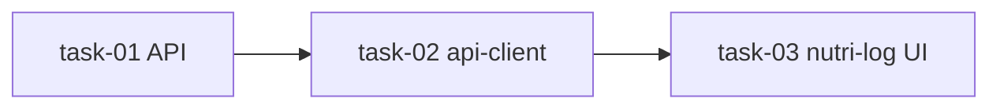

# Task List — NutriLog MVP (Weight Logging)

**Epic:** `2026-06-12-epic-nutrilog-mvp`  
**Prerequisite:** Signed `requirements.md`  
**Execution order:** serial — API → api-client → NutriLog UI

| ID | Summary | Target paths | Depends on | Verification command | Agent |
|----|---------|--------------|------------|----------------------|-------|
| 01 | `nl_weight_logs` migration + Go API endpoints | `apps/api/db/migrations/`, `apps/api/internal/nutrilog/`, `apps/api/internal/handlers/`, `apps/api/internal/server/server.go` | — | `cd apps/api && go test ./...` | `test-writer-go` → `implementer-go` |
| 02 | Typed NutriLog weight client | `packages/api-client/src/` | 01 | `pnpm --filter @rpgtracker/api-client test` | `test-writer-ts` → `implementer-ts` |
| 03 | NutriLog app shell + weight logging UI | `apps/nutri-log/app/` | 02 | `pnpm --filter nutri-log test` | `test-writer-ts` → `implementer-ts` |

## Dependency graph

## Out of epic scope (do not touch)

- `apps/rpg-tracker/` hub placeholder and `HubPlaceholderCard`
- `apps/mental-health/`
- Cross-app XP (`F-020`)
- Calorie/macro, goals, barcode, AI features (`F-014`–`F-018`)

## Post-epic follow-ups (not tasks here)

- F-018 goal setting (target weight, weekly rate)
- F-014 calorie/macro logging (after food provider decision)
- F-020 hub XP + live hub dashboard metrics
- Hub `/nutri` route → NutriLog deep link or embedded experience
