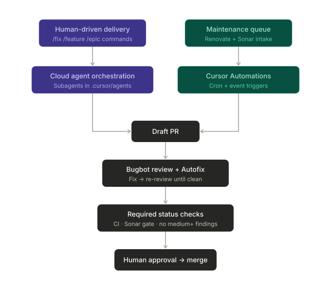
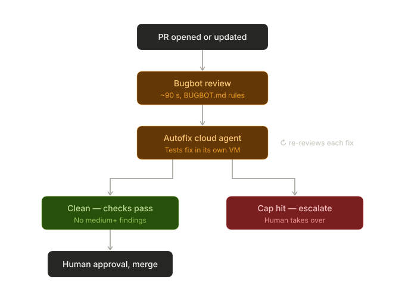
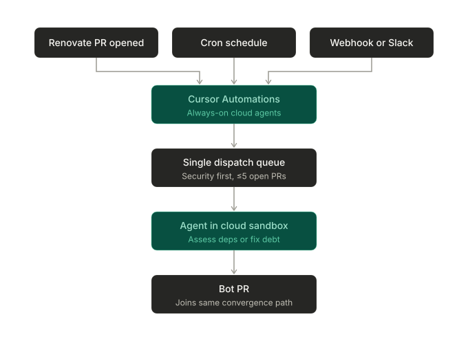

# Agentic Engineering Pipeline Showcase — Project Brief

> Purpose: demonstrate that agentic tooling can compress the iterate → review → maintain loop on a real GitHub repo, with quality gates that make the automation trustworthy rather than scary. This document is the input brief for BMAD (Analyst → PM → Architect) or an OpenSpec change set. Treat anything marked **[DECISION]** as something to resolve before specs are written.

---

## 1. Vision & Showcase Narrative

One repository where:

1. A PR opens → Bugbot reviews it → an agent reads the review, fixes legitimate findings, pushes, and the review re-runs until clean (bounded iterations).
2. Renovate proposes dependency upgrades → an assessment agent classifies each as safe / risky / breaking → safe ones auto-merge behind green CI; breaking ones get a research-annotated PR (changelog digest, affected call sites, suggested migration) but are never auto-applied.
3. A tech-debt agent pulls from a prioritised pile (SonarCloud issues + a tickets backlog) and ships small, test-backed remediation PRs on a schedule.

The demo story is **"humans review intent, agents do toil"** — and structurally, **one quality pipeline with two entry points**: human intent enters from the top via scoped commands (`/feature`, `/epic`, …) driving cloud-agent delivery with TDD, and the maintenance queue (deps + debt) enters from the side. Everything — human-written, agent-written, bot-written — converges through the same PR path: Bugbot loop, severity gate, test gates, human approval. No silent merges, ever.

## 2. Goals / Non-Goals

**Goals**
- End-to-end working demo on one representative repo (ideally with real-ish .NET/React (TypeScript) code so it resonates internally).
- Four pillars working together: agentic delivery (D) building features through the same gates that maintenance automation (A–C) flows through.
- A growing library of agents, skills, and commands as reusable artifacts — written here, evaluated rigorously in the separate eval project later.
- Hard guardrails: branch protection, required CI, agents never bypass review.
- Measurable outcomes: PRs opened vs merged, review-fix cycle time, dependency freshness, Sonar issue burn-down.
- Reusable patterns (workflow templates + config) other teams could adopt.

**Non-Goals (v1)**
- Multi-repo orchestration.
- Auto-merging anything with a failing or absent test signal.
- **The custom Cursor plugin with built-in evaluation — that is a separate project entirely.** This showcase uses off-the-shelf signals only (§7); the only deliberate overlap is that the golden-PR set and outcome metrics built here become reusable test assets for that later project.
- Fixing *every* Bugbot/Sonar finding — only categories on an allowlist.

## 3. Pillars (candidate OpenSpec capabilities)

### Pillar A — Dependency hygiene with safety assessment
- Run **Renovate** self-hosted via the official GitHub Action / Docker image on a schedule (gives you the "Renovate CLI" angle and full config control vs the hosted app).
- Lean on **Renovate's built-in signals before building your own**: Merge Confidence badges, `stabilityDays`/`minimumReleaseAge`, grouped updates, and semver-major detection via `packageRules`.
- Layer the agentic part on top: a workflow triggered on Renovate PRs that
  1. classifies the update (patch/minor/major, confidence, changelog scan),
  2. for *safe*: enable auto-merge (squash) gated on full CI + Sonar quality gate,
  3. for *breaking/risky*: agent fetches release notes, greps the codebase for affected APIs, and posts a structured comment: impact summary, breaking changes list, proposed migration steps, optionally a draft fix commit on a side branch — **highlight, don't auto-fix**, per the design intent.
- Config artefacts: `renovate.json5` (packageRules, labels like `deps:safe` / `deps:breaking`), `.github/workflows/renovate.yml`, `.github/workflows/dep-assess.yml`.

### Pillar B — Review → autofix loop
- **[RESOLVED: native Bugbot Autofix, not a custom loop.]** Autofix is out of beta (GA Feb 2026) and runs cloud agents in their own VMs that *test* proposed fixes before posting them; the Jun 10, 2026 update made reviews >3x faster (~90s typical, 90% under 3 min), ~22% cheaper per run, and ~10% better at finding bugs. The original argument for a custom loop ("more demonstrable and controllable") no longer holds — verified-in-VM fixes plus fast re-review iterations beat a hand-rolled comment-driven loop, and the showcase story shifts from "we built the loop" to "we tuned and gated the loop."
- Configuration choice within Autofix: propose-fix-as-comment (merge via `@cursor` command) vs push-directly-to-branch. Start with propose mode while trust is built; flip to direct-push once the golden-PR suite shows acceptable fix quality. Either way the loop is: review → Autofix agent tests fix in its own VM → push/propose → review re-runs → repeat until clean or cap.
- Guardrails survive as **policy and config rather than workflow code**: iteration cap then escalate to human; agent commits attributed distinctly; hooks + CODEOWNERS still deny workflow-file and secret edits regardless of who authors the fix.
- Tune Bugbot with a repo-level `BUGBOT.md` rules file so findings match your standards (also great showcase material — "we encode team standards once"). The "no open medium+ findings" required status check (§4b) is unchanged — it gates *outcomes*, so it is agnostic to whether the fixes came from native Autofix or anywhere else.
- Note Bugbot moved to usage-based billing (Jun 2026): roughly $1.00–$1.50 per run depending on PR size, and the autofix loop multiplies runs per PR — feed this into the §8 budget line.

### Pillar C — Tech-debt burner
- **Intake**: SonarCloud Web API (issues filtered by rule/severity/effort) + a backlog source (GitHub Issues with a `tech-debt` label to start; Jira/ADO adapter later). Normalise both into one queue item shape: `{source, id, description, files, est_effort, risk}`.
- **Triage agent**: scores items on confidence-to-fix vs blast radius; only items under thresholds are eligible (e.g. single-file, has test coverage, Sonar effort ≤ 30min). Natural fit for the SDK's subagent pattern: an orchestrator (plain Python) pulls the queue, a triage subagent scores, an execution subagent fixes — separate prompts, separately evaluable.
- **Execution**: scheduled workflow picks top K eligible items per week → headless agent per item → branch → fix → run tests + Sonar analysis on the branch → PR with the original finding, what changed, and proof (test output, Sonar delta).
- Closing the loop: merged PR comments/links back to the Sonar issue or ticket.

### Pillar D — Command-driven agentic delivery (the main development flow)
- The primary way features get built on the repo, and a deliverable in its own right: scoped commands (`/fix`, `/feature`, `/epic`, `/new-project`) → elicitation → signed requirements artifact → cloud-agent orchestration → TDD with separated subagents → draft PR into the Pillar B convergence loop. Full flow specified in §4b.
- **What gets written here**: the command definitions, the skill chains (elicitation, decomposition, test-writer, implementer), orchestrator logic, and the guardrail hooks (test-file lock, workflow-file deny). These agents/skills are concrete artifacts of this project — the **evaluation framework that will later measure them is the separate project**, but it inherits these as its subjects, plus the golden-PR set and per-surface outcome metrics as its seed data.
- Pillars A–C keep the repo healthy; Pillar D is how new value lands on it. Together they cover the full loop: build, review, maintain.

## 4. Cross-cutting Architecture

- **Runner [REVISED]: Cursor Automations are the primary dispatch layer** for event-triggered and scheduled pipeline work — always-on cloud agents fired by cron schedules, GitHub PR events, Slack/Linear, or custom webhooks, each run in an isolated cloud sandbox with configured MCP tools, and with a memory tool that carries learnings across runs (something stateless SDK calls never had). This absorbs most of what GitHub Actions + SDK-in-CI was slated for: the Renovate-PR-opened trigger (Pillar A), the weekly tech-debt cron (Pillar C), and ad-hoc webhook intake. GitHub Actions remain for what they're best at — CI itself (build/test/Sonar) and required status checks — not agent orchestration. The **Cursor SDK** (Python public beta, TS since April) drops to a supporting role: reach for it only where orchestration logic can't be expressed as an Automation prompt + MCP tools (e.g. the triage scoring function — which can equally live as a small script the automation's agent runs). Keep `cursor-agent` CLI for trivial one-shot steps. Comparison track: Claude Code GitHub Action on one pillar still stands. Use **hooks** as harness-level guardrails (e.g. deny edits to `.github/workflows/**`, deny shell commands outside an allowlist) in addition to repo-level controls. **Governance note**: Automations run in Cursor's cloud under team-owned service accounts and bill to the team usage pool — the §6 kill-switch and budget controls need Cursor-side equivalents (disable the automation, usage caps in the dashboard) in addition to the repo-side `AGENTS_ENABLED` variable, which Automations do not implicitly respect. Add this to M0.
- **Local dev workflow**: build the pipelines themselves in Cursor 3's Agents Window — multi-repo workspace, worktree-isolated parallel agents (one per pillar), `/multitask` for decomposable work. Document this; "we built the agent platform with agents" is part of the showcase.
- **Permissions**: fine-grained GitHub App or PAT per workflow; agents get `contents:write` + `pull-requests:write` only; branch protection on `main` requires human review + CI + Sonar gate; CODEOWNERS for sensitive paths; agents cannot edit `.github/workflows/**` (enforce via CODEOWNERS + a CI check).
- **Idempotency & loop safety**: concurrency groups per PR; iteration counters stored as PR labels or check-run metadata; kill-switch repo variable (`AGENTS_ENABLED=false`).
- **Observability**: every agent job emits a structured summary (job summary markdown + JSON artifact): trigger, input, actions taken, tokens/cost if available, outcome. Weekly metrics job aggregates into a dashboard issue or a simple static page.

### 4a. Orchestration & Working Method (how tasks actually get done)

**Execution surface — pick per task, not per project:**

| Surface | Use when | Verification |
|---|---|---|
| Local agent in IDE | Exploratory, architectural, needs steering; supervising early pipeline runs | Human-in-loop, continuous |
| Parallel local agents (worktrees) | Decomposable work with independent file boundaries (`/multitask` / Build in Parallel) | Per-branch CI + human merge |
| **Cloud agent w/ full environment (primary delivery surface)** | All command-driven delivery (§4b); anything needing browser/E2E testing; prompted from IDE or web | Agent self-verifies in sandbox; artifacts (video/screenshots/logs) as evidence; PR convergence path |
| SDK in CI | Event-triggered pipeline work (the three pillars, maintenance queue) | Hooks + test gates + Bugbot |

**Environment as a first-class deliverable (extend M0):** cloud agents are only as capable as their environment — define a Dockerfile-based agent environment (deps, build toolchain, test runner, any internal service access) with scoped secrets so cloud agents can *close the loop* (build → test → browser-verify) rather than just write plausible code. Enabling full envs + browser testing is what turns "agent opened a PR" into "agent opened a PR with a video of the feature working".

**Serverless-first application architecture (org guidance):** the template apps and anything agents build should follow the org's serverless-first preference (e.g. Azure Functions over containerised services) where viable. Note the distinction: the Dockerfile above configures the *agent's dev environment*, not application deployment — it's orthogonal to this guidance, and is in fact what makes serverless code agent-testable. Implication for the environment definition: include the local serverless toolchain (Azure Functions Core Tools, Azurite or equivalent emulators, event-source stubs) so agents can run and verify serverless code end-to-end in their sandbox. This is known extra setup work — budget for it in M0 and encode the serverless patterns in the pattern-library skills so agents default to them.

**Task breakdown rules (apply before dispatching anything):**
1. One task = one verifiable outcome with explicit acceptance criteria and a named verification command/check.
2. Self-contained context: everything the agent needs is in the task (SDK runs and cloud agents don't share state between runs).
3. Independence test before parallelising: tasks touching overlapping files/modules are serialised or merged.
4. Size cap: if a task can't be verified in one PR, it's a plan, not a task — break it down again.

**Planning method — custom command-driven pipeline (replaces the BMAD/OpenSpec ladder for day-to-day delivery):**

Scoped Cursor commands route to skill chains at the right ceremony level. Commands are thin routers; skills do the work; **every stage ends by writing an artifact** (requirements.md, test plan, task list) and the next stage consumes the artifact, not the chat — this is what survives stateless SDK runs, cloud handoffs, and fresh sessions.

- `/fix` — known defect: skip elicitation, straight to test-first fix.
- `/feature` — lightweight requirements elicitation → spec → dispatch.
- `/epic` — adds decomposition into independently-verifiable tasks (task rules above).
- `/new-project` — adds architecture stage before decomposition.

(BMAD remains the bootstrap tool for *this* project's own PRD/architecture, and a reference design for the skill chains — but the showcase ships its own pipeline.)

### 4b. The Delivery Pipeline (end-to-end flow)

**Flow:** scoped command → elicitation → **signed requirements artifact (the one mandatory human checkpoint)** → cloud orchestrator → red tests → implementation (tests locked) → draft PR → Bugbot pipeline loop → severity check gates merge.

**Orchestration surface [RESOLVED]: Cursor cloud agents are the primary execution surface**, prompted from the IDE Agents Window or the web app (cursor.com/agents — also reachable from mobile/Slack). Local IDE agents remain for exploratory/architectural work and for supervising early runs while trust is built; the skill chains are authored to work identically from both, which the artifact rule guarantees. Headless triggering via SDK/automations is the same pipeline with a different entry point, not a different design.

**TDD with separated subagents (structural safeguard):**
1. Test subagent writes tests from the requirements artifact only.
2. Orchestrator verifies tests *fail* (red confirmed — also catches vacuous tests).
3. Implementer subagent runs with a hook **denying edits to test files**; iterates to green.
4. Tests are thereby the machine-checkable form of the signed requirements.

**Convergence path [RESOLVED]: PR + GitHub pipelines, not local iterate-until-clean.** One optional cheap local review pass to clear trivial noise, then draft PR early and let the Pillar B loop (Bugbot review → autofix → re-review, iteration-capped) drive findings down. "No open medium+ Bugbot findings" is a **required status check** on protected branches — a gate, not a convention; hitting the iteration cap escalates to a human. Rationale: one convergence loop instead of two implementations of the same logic; PR-native evidence trail; and *all* code — human, IDE agent, cloud agent, maintenance bot — converges through the same quality path. That uniformity is the governance story.

**Maintenance layer flow control (Pillars A + C as a single queue):** Mend/Renovate + Sonar run daily, but fixes dispatch through one prioritised queue, not two firehoses: security vulnerabilities with a known-clean version first, then top-N Sonar issues ranked by triage score (confidence-to-fix × impact — *not* raw size; the burner earns trust shipping boring, obviously-correct PRs first). Cap concurrent open bot PRs (3–5) to protect review capacity — unbounded bot PR volume is the most common way these systems lose team trust. Maintenance PRs flow through the identical convergence path above.

**Orchestration mechanics (context management for long tasks):**
- Subagents are markdown files in `.cursor/agents/*.md` (YAML frontmatter: name, description, model, readonly, is_background); the description is the delegation trigger — write it as a precise "use when…" condition, and for per-stack variants make the conditions **mutually exclusive on file paths** (see §4c). Don't rely on the parent improvising decomposition.
- The orchestrator stays thin: it never reads large files or runs noisy commands directly — all exploration/shell/browser work routes through the built-in Explore/Bash/Browser subagents (or ours), which return summaries while intermediate output stays isolated.
- Subagents + the artifact rule together are the long-task strategy: subagents write full detail to repo files and return summary + path; the parent reads artifacts on demand. Repo files are durable memory; chat context is disposable. This substitutes for context compaction — Cursor's relative weakness — by removing the need for long sessions.
- Prefer many short agents over one long one: fresh cloud agent per decomposed task, clean start, artifact as input. Background subagents (resumable via agent ID) for supervising slow runs without blocking.
- Roster discipline: skills carry knowledge *into* context, subagents keep noise *out* of it. Start with ~3–4 (explore, test-writer, implementer, verifier — verifier deliberately skeptical, with read-only + test-run tools); parallel subagents multiply token cost (~N×), so parallelise only independent work.

**Quality assurance for agent-produced work (uniform regardless of surface):**
- Definition of done: acceptance criteria met + tests pass + Sonar gate green + Bugbot review clean (agents review agents — every agent PR gets Bugbot like any human PR).
- Cloud agent tasks additionally require their verification artifact attached to the PR.
- Human approval is the merge gate, always — the orchestrator's job is reviewing *intent and evidence*, not re-doing the work.
- Track per-surface outcomes (merged-unmodified rate by surface) — this data is itself showcase material and feeds the separate eval project.

**[RESOLVED]** Cloud agent hosting: **Cursor-hosted** — org-level trust already established, simplicity wins. (Self-hosted cloud agents exist as a fallback if a future repo's data classification demands it; not a v1 concern.)

### 4c. Agent definition layering (base / stack / role)

The repo is multi-stack (React/MUI/TypeScript frontend, .NET backend, Python tooling), and an implementer's job description is mostly stack-specific: the test runner it must invoke, the build it must keep green, the patterns it should reach for. Rather than one monolithic definition per agent, every agent run **composes three layers**:

**Layer 1 — Base (unconditional, every agent, every surface).**
- Root `AGENTS.md`: repo-wide conventions, artifact rules, the task-breakdown rules from §4a.
- Security rules in `.cursor/rules` with `alwaysApply: true`: never log or commit secrets, never weaken or skip tests, serverless-first architecture, least-privilege defaults.
- Hooks for everything that must hold *even if the model ignores instructions*: deny edits to `.github/workflows/**`, deny test-file edits during implementation, shell-command allowlist.
- Operating principle: **rules instruct, hooks enforce.** Anything security-critical gets the hook; the rule exists so the agent understands *why* and doesn't waste iterations fighting the hook. Branch protection + CODEOWNERS sit behind both as the layer no agent can touch.

**Layer 2 — Stack (scoped by location).**
- Nested `AGENTS.md` files per area — `frontend/AGENTS.md` (React/MUI/TS), `backend/AGENTS.md` (.NET), `tools/AGENTS.md` (Python) — plus glob-scoped rules where finer targeting is needed. Agents pick these up based on where they work; the orchestrator never injects stack context manually.
- This layer **is the pattern library from resolved decision §8.1** — same artifact, now with a defined home. Stack-specific skills (SKILL.md) live alongside for knowledge that should load on demand rather than always.

**Layer 3 — Role (the subagent matrix, `.cursor/agents/`).**
- Roles whose *mechanics* differ per stack get one variant per stack: `implementer-react.md`, `implementer-dotnet.md`, `implementer-python.md`; likewise `test-writer-*` (Vitest/Jest + React Testing Library vs xUnit vs pytest are genuinely different jobs).
- The **verifier stays a single shared agent**: skepticism, read-only tools, and "run the named verification command" are stack-agnostic — the command itself comes from the task artifact.
- Routing is mechanical: the decomposition stage tags each task with its target area/paths; each variant's `description` frontmatter states its paths ("Use when implementing tasks touching `backend/**` (.NET)…"), mutually exclusive across variants, so delegation never dithers.
- **Anti-explosion rule**: a role earns a stack variant only when its *mechanics* differ (toolchain, runner, build commands). Pure knowledge differences belong in Layer 2, which every agent inherits for free. 3 roles × 3 stacks is the ceiling for v1.

Deliverables from this section: the three-layer config tree itself, plus a one-page "composition contract" doc explaining resolution order — reusable showcase output in its own right.

## 5. Milestones

- **M0 — Foundation (repo + gates + environment)**: pick/create demo repo, CI (build/test), SonarCloud hooked up with quality gate, branch protection, CODEOWNERS, kill-switch **(both repo-side `AGENTS_ENABLED` and Cursor-side: automation disable + usage caps in the dashboard)**, the §4c layered config tree (root + nested AGENTS.md, alwaysApply security rules, hooks), **and a Dockerfile-based cloud-agent environment with scoped secrets** so agents can build/test/browser-verify end-to-end. *Nothing agentic merges anywhere without this.*
- **M1 — Renovate baseline**: self-hosted Renovate workflow, sensible packageRules, Merge Confidence surfaced, auto-merge for patch-level with green CI.
- **M2 — Dependency assessor agent**: classification + breaking-change research comments on major bumps.
- **M3 — Bugbot + Autofix**: Bugbot enabled + `BUGBOT.md` rules + native Autofix in propose mode with iteration cap and escalation policy; the "no medium+ findings" required status check wired into branch protection. Flip to direct-push mode only after golden-PR results justify it.
- **M4 — Maintenance queue (Pillars A + C unified)**: Sonar intake + triage scoring + Mend/Renovate security-first prioritisation into a single dispatch queue with a concurrent-PR cap, **dispatched via Cursor Automations** (Renovate-PR event trigger + weekly cron); weekly scheduled fixes (start with one rule category, e.g. code smells in a single module).
- **M5 — Command-driven delivery pipeline**: `/fix`, `/feature`, `/epic`, `/new-project` commands + skill chains (elicitation → requirements artifact → cloud orchestration → TDD subagents → draft PR), with the medium+ severity status check enforced. Depends on M0 + the §4c layered config (incl. pattern library) + M3's loop.
- **M6 — Telemetry & showcase pack**: metrics aggregation, demo script, before/after numbers, adoption guide.

Each milestone is demoable on its own — if time runs out, M0–M3 is already a strong showcase.

## 6. Risks & Mitigations

- **Agent loops / runaway costs** → iteration caps, concurrency groups, kill-switch, per-job budget.
- **Plausible-but-wrong fixes** → test-gated merges only; restrict autofix to allowlisted finding categories; human approval always required to merge.
- **Renovate noise** → grouping, schedules ("before 6am on Monday"), `minimumReleaseAge`, dashboard issue.
- **Security**: prompt injection via PR content/changelogs → agents run with least privilege, never execute fetched code outside sandboxed CI, workflow files protected.
- **Demo fragility** → seed the repo with known bugs/debt so every pillar has guaranteed material on demo day.
- **Automations governance gap** → Automations run in Cursor's cloud and don't respect repo variables; mirror every repo-side control (kill-switch, budget, concurrency) with its Cursor-dashboard equivalent, and review automation permission scope (team-owned vs private) explicitly.

## 7. Evaluation (for this project only — the plugin-with-evals is a separate workstream)

- **Golden PR set**: 10–15 seeded PRs with known injected bugs; measure Bugbot detection rate and agent fix success (CI green + bug actually gone) as a regression suite for prompt/rule changes.
- **Outcome metrics over vibes**: % agent PRs merged unmodified, human edit distance on agent PRs, cycle time, Sonar issue count trend, dependency staleness (e.g. libyear).
- **Tracing**: Langfuse or LangSmith (or just structured JSON artifacts at first) for prompt/version comparison; promptfoo for any custom prompts you iterate on (e.g. the dependency classifier).
- Defer the bespoke eval platform until the golden-PR suite stops being enough.

## 8. Open Decisions for Spec Phase

1. **[RESOLVED]** Demo repo: built from template apps using familiar, documented patterns. Corollary deliverable (pre-M0): a **pattern library** — each template/pattern documented as an Agent Skill (SKILL.md) in `.cursor`, with static conventions as rules — so every agent surface (IDE, cloud, SDK) reproduces the same patterns. This library is itself reusable showcase output.
2. **[RESOLVED]** Agent runtime per pillar: **Cursor Automations as the dispatch layer** for all event/scheduled work (§4); Cursor cloud agents for delivery (§4b); SDK only where custom orchestration logic is genuinely needed; one pillar on Claude Code Action for comparison. Pin versions and expect churn on anything beta.
3. **[RESOLVED]** Bugbot native Autofix over a custom loop (§ Pillar B) — start in propose mode, graduate to direct-push on golden-PR evidence.
4. Ticket source for Pillar C v1: GitHub Issues only, or wire Jira/ADO immediately?
5. Where metrics live: job summaries + an issue, or a small static dashboard?
6. Budget/licensing check: Bugbot is now usage-based (~$1.00–$1.50/run; autofix loops multiply runs per PR), Automations bill to the team usage pool in Max Mode — model expected runs/month per pillar rather than seats; plus Cursor cloud-agent usage and SonarCloud tier.

## 9. Suggested Spec Breakdown (OpenSpec/BMAD)

- `change/foundation-gates` → M0 (now includes the §4c layered config tree + Cursor-side controls)
- `change/renovate-baseline` → M1
- `change/dep-assessment-agent` → M2 (spec the classification contract: inputs, output schema, comment format)
- `change/bugbot-autofix-config` → M3 (spec the *policy*, not a state machine: BUGBOT.md rule set, propose vs direct-push criteria, iteration cap, escalation path, status-check wiring)
- `change/tech-debt-pipeline` → M4 (spec intake schema, triage scoring function, eligibility rules, Automation triggers)
- `change/agent-layering` → §4c (spec the composition contract: layer resolution order, subagent matrix, description routing conventions)
- `change/telemetry` → M6

For BMAD: this doc ≈ the Analyst brief; run PM to turn pillars into a PRD with acceptance criteria per milestone; run Architect on §4 before any workflow code.

## Diagrams

### Pipeline Overview

Overview of the pipeline, showing the two entry points (IDE and web, where Pillar D is orchestrated) and the automated pipelines (Pillar A and C).

Overview of the Pillar D orchestration, showing the subagents and the orchestrator (Pillar D).

Overview of the Bugbot Autofix convergence loop, showing the loop and the escalation path (Pillar B).

Overview of the Maintenance Queue pipeline, showing the pipeline and the automation (Pillar C).

Overview of the Agent Layer, showing the three layers (Base, Stack, and Role).
