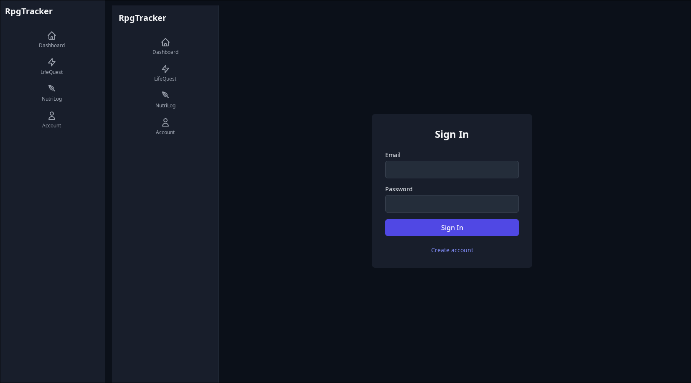

# bugs 

The on hover border on the skills filters on /skills gets cut off on the top and bottom and looks odd.

Someone can pick a preset skill and alter the category? Should we really be allowing this in csase of future scope issues.

Sidebar doesn't go alll the way on longer pages.

