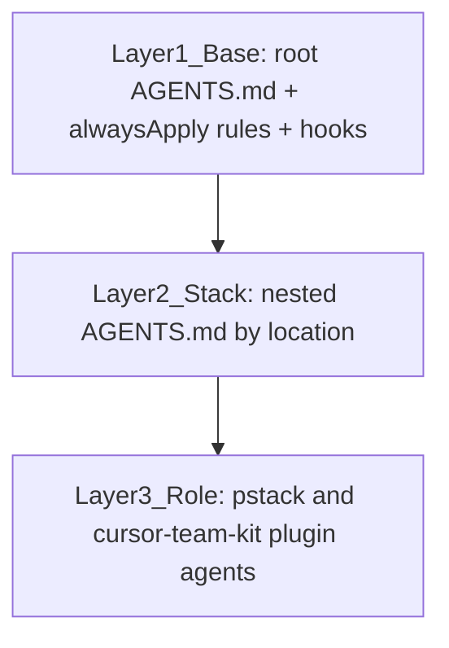

# Agent Composition Contract

How agent configuration composes in this repo (brief §4c, D-055/D-058, updated D-063). Every agent
run — IDE, cloud, CI, Automations — resolves three layers, in order. Lower layers never override
higher-layer security constraints.

## Resolution Order

### Layer 1 — Base (unconditional)

| Artifact | Purpose |
|---|---|
| `AGENTS.md` (root) | Repo map; durable docs live in `docs/` |
| `.cursor/rules/*.mdc` with `alwaysApply: true` | Security baseline, repo context, workflow rules, pstack model mapping |
| `.cursor/hooks.json` + `.cursor/hooks/` | Enforcement: deny force-push and destructive shell patterns. Workflow-path denies temporarily relaxed during pipeline iteration (D-061). TDD lock retired (D-063). |
| `.github/CODEOWNERS` + branch protection | The layer no agent can touch |

Operating principle: **rules instruct, hooks enforce.** Anything security-critical has a hook; the
rule exists so agents understand why and do not waste iterations fighting it.

### Layer 2 — Stack (scoped by location)

| File | Stack | Verification command |
|---|---|---|
| `apps/api/AGENTS.md` | Go (chi, pgx, migrations) | `go test ./...` from `apps/api` |
| `apps/rpg-tracker/AGENTS.md` | TypeScript / Next.js frontends | `pnpm test:ci` (targeted first) |
| `packages/AGENTS.md` | Shared TS packages | `pnpm --filter <pkg> test` |

This layer is the pattern library: agents pick these up based on where they work. On-demand
procedure for development lives in the **pstack** and **cursor-team-kit** plugins, not in a
repo-managed skill index (D-063).

### Layer 3 — Role (plugin agents)

| Definition | Use when |
|---|---|
| `poteto-agent` (pstack) | Multi-step development via `/poteto-mode` |
| Comment Sicko (pstack) | Comment cleanup, usually via `/no-comments` |
| Built-in `explore` / `bash` / `browser` | Noisy reads, shell isolation, UI checks |

Per-role model choices are in `.cursor/rules/pstack-models.mdc`. Do not recreate repo-managed
`.cursor/agents/` or `.cursor/commands/` that compete with these plugins.

**Anti-explosion rule:** a role earns a stack variant only when its mechanics differ (toolchain,
runner, build commands). Pure knowledge differences belong in Layer 2 stack guides.

## Conflict Resolution

1. Hooks and branch protection always win — they are not advisory.
2. `alwaysApply` rules beat stack and role guidance.
3. Stack guidance beats role guidance on stack mechanics; role guidance beats stack guidance on
   role procedure.
4. Named verification commands in stack `AGENTS.md` files are authoritative for that zone.
