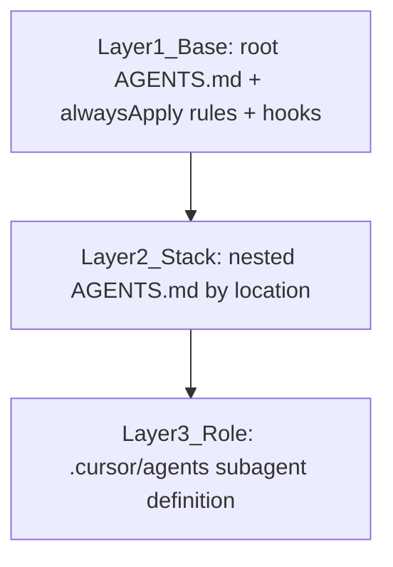

# Agent Composition Contract

How agent configuration composes in this repo (brief §4c, decided in D-055/D-058). Every agent
run — IDE, cloud, CI, Automations — resolves three layers, in order. Lower layers never override
higher-layer security constraints.

## Resolution Order

### Layer 1 — Base (unconditional)

| Artifact | Purpose |
|---|---|
| `AGENTS.md` (root) | Repo map, working rules, doc-update obligations |
| `.cursor/rules/*.mdc` with `alwaysApply: true` | Security baseline, repo context, workflow rules |
| `.cursor/hooks.json` + `.cursor/hooks/` | Enforcement: deny `.github/workflows/**` edits, deny test-file edits while `.cursor/tdd-lock` exists, deny force-push and workflow writes via shell |
| `.github/CODEOWNERS` + branch protection | The layer no agent can touch |

Operating principle: **rules instruct, hooks enforce.** Anything security-critical has a hook; the
rule exists so agents understand why and do not waste iterations fighting it.

### Layer 2 — Stack (scoped by location)

| File | Stack | Verification command |
|---|---|---|
| `apps/api/AGENTS.md` | Go (chi, pgx, migrations) | `go test ./...` from `apps/api` |
| `apps/rpg-tracker/AGENTS.md` | TypeScript / Next.js frontends | `pnpm test:ci` (targeted first) |
| `packages/AGENTS.md` | Shared TS packages | `pnpm --filter <pkg> test` |
| `apps/cursor-lab/AGENTS.md` | Python tooling | `cursor-lab doctor`, pytest |

This layer is the pattern library: agents pick these up based on where they work; orchestrators
never inject stack context manually. On-demand knowledge lives in `.cursor/skills/`
(`skills.index.json` is the discovery index).

### Layer 3 — Role (`.cursor/agents/`)

| Definition | Paths (mutually exclusive routing) |
|---|---|
| `test-writer-go.md` / `implementer-go.md` | `apps/api/**` |
| `test-writer-ts.md` / `implementer-ts.md` | `apps/rpg-tracker/**`, `apps/nutri-log/**`, `apps/mental-health/**`, `packages/**` |
| `verifier.md` | Any stack (read-only + run the artifact's named verification command) |

Routing is mechanical: the decomposition stage tags each task with target paths; each variant's
`description` frontmatter states its paths so delegation never dithers.

**Anti-explosion rule:** a role earns a stack variant only when its mechanics differ (toolchain,
runner, build commands). Pure knowledge differences belong in Layer 2. Ceiling for v1: 3 roles x
2 stacks (D-058); Python tooling is Layer-2-only.

## Conflict Resolution

1. Hooks and branch protection always win — they are not advisory.
2. `alwaysApply` rules beat stack and role guidance.
3. Stack guidance beats role guidance on stack mechanics; role guidance beats stack guidance on
   role procedure (e.g. the test-writer's "never write implementation" beats any stack workflow
   step that says "implement").
4. The task artifact's acceptance criteria and named verification command are authoritative over
   all prose.
