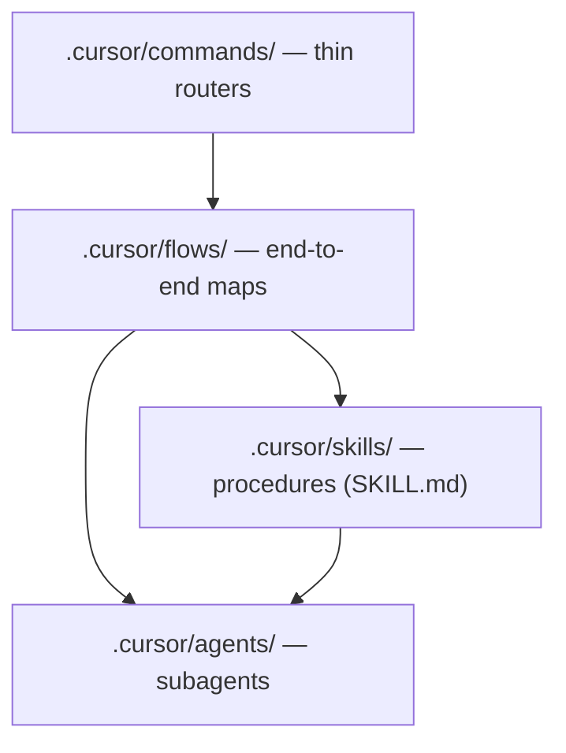

# Cursor Skills, Subagents, and Flows

How this repo structures agent orchestration on top of Cursor's 2026 agent-skills and subagent
model. Canonical pipeline context: `Documentation/agentic-pipeline/Agentic-Pipeline-Brief-v2.md`.

## Artifact layers



| Layer | Location | Discovery |
|---|---|---|
| Commands | `.cursor/commands/*.md` | User types `/fix`, `/feature`, … |
| Flows | `.cursor/flows/*.md` | Repo index in `flows/README.md` |
| Skills | `.cursor/skills/<domain>/<name>/SKILL.md` | `description` frontmatter + `skills.index.json` |
| Subagents | `.cursor/agents/<name>.md` | `description` with "Use when…" |

Cursor also supports `.agents/skills/` for compatibility; this repo standardizes on
`.cursor/skills/` (D-062).

## Skills (agent skills)

Each skill is a folder with `SKILL.md` and YAML frontmatter:

```yaml
---
name: pipeline-orchestration
description: Route work across lanes… Use when starting feature work.
metadata:
  domain: orchestration
paths:
  - "packages/cursor-agents/**"   # optional — file-scoped auto-attach
---
```

Required sections: **When to use**, **Inputs**, **Outputs**, **Examples** (enforced by
`pnpm validate:skills`).

Optional subfolders per Cursor convention:

- `scripts/` — deterministic helpers the agent may run
- `references/` — long docs loaded on demand
- `assets/` — templates, diagrams

**Progressive loading:** only `description` is always visible; full `SKILL.md` loads when the
skill is invoked. Keep descriptions specific — they are the primary routing signal.

Index maintenance: update `.cursor/skills/skills.index.json` on every add/rename/remove.

## Subagents

Subagents live in `.cursor/agents/*.md`:

```yaml
---
name: verifier
description: Use when independently verifying a completed task…
readonly: true
model: gpt-5.5[context=272k,reasoning=high,fast=false]
---
```

| Field | Purpose |
|---|---|
| `description` | **Primary routing signal** — must say when to delegate |
| `readonly` | Prevents writes (verifier, scouts, highlight agents) |
| `model` | Optional per-agent model override |
| `is_background` | Optional — long-running supervisor pattern |

Built-in subagents (`explore`, `bash`, `browser`) complement repo-defined agents. Use them for
noisy exploration; repo agents carry stack-specific procedure.

Roster: `.cursor/agents/README.md` · composition: `docs/guides/agent-composition-contract.md`.

## Flows (orchestration manifests)

Flows are **repo documentation**, not a Cursor-built-in directory. They map:

1. Entry trigger (command, workflow, Automation cron)
2. Skill chain (ordered)
3. Subagent roster
4. Artifacts to write
5. Exit criteria

See `.cursor/flows/README.md` for the index.

### Orchestrator pattern (Pillar D)

```
delivery-orchestrator (thin parent)
  → test-writer-{go,ts}  (red)
  → implementer-{go,ts}  (green, TDD lock)
  → verifier             (skeptical pass/fail)
  → draft PR → Bugbot loop
```

Parent stays thin: delegate file reads and shell output to `explore` / `bash` subagents; persist
detail in `Documentation/delivery/` artifacts.

### Three-lane routing (D-060)

| Lane | Skills / agents | Flow |
|---|---|---|
| Bugbot | `bugbot-advisory` (context only) | Pillar B — review + Autofix |
| SDK | `sdk-remediation-routing`, `dependency-quality-triage` | `sdk-remediation`, `pillar-a-deps-highlight` |
| Automations | `maintenance-dispatch`, `local-cloud-route` | `pillar-c-maintenance` |

## Validation

```bash
pnpm validate:skills   # index ↔ files, frontmatter, required sections
pnpm validate:agents   # agent frontmatter + "Use when" routing
pnpm validate:flows    # command flows + referenced skills/subagents
pnpm validate:cursor   # all of the above
```

`check:precommit` runs `validate:cursor`.

## Adding a new skill or agent

1. Create `SKILL.md` or `.cursor/agents/<name>.md` following existing patterns.
2. Add skill to `skills.index.json` (agents are file-discovered; no index required).
3. If part of a pipeline, add or extend a flow in `.cursor/flows/`.
4. Run `pnpm validate:cursor`.
5. Update `feature-tracker.md` if scope/status changes; `decision-log.md` if binding policy changes.

## References

- Cursor docs: [Agent Skills](https://cursor.com/docs/context/skills), [Subagents](https://cursor.com/docs/context/subagents)
- Repo handbook: `docs/CURSOR-AGENT-HANDBOOK.md`
- Operator checklist: `docs/guides/agentic-pipeline-operator-checklist.md`
